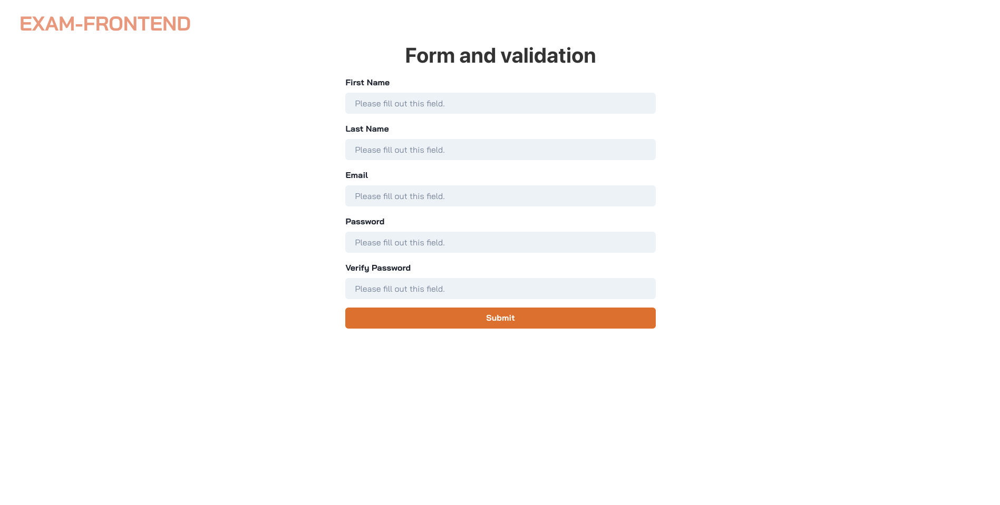
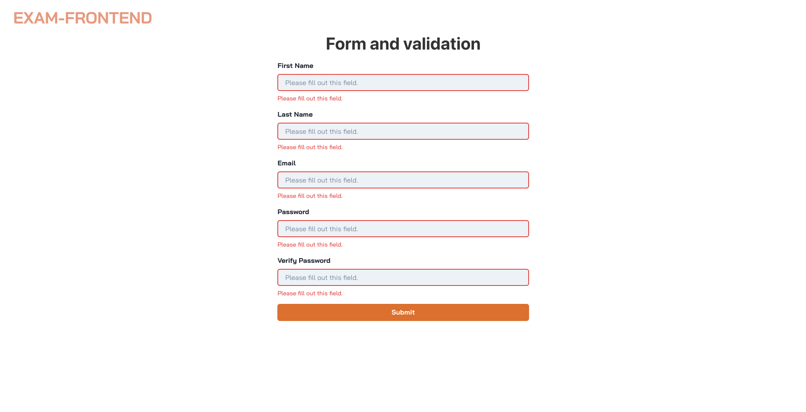
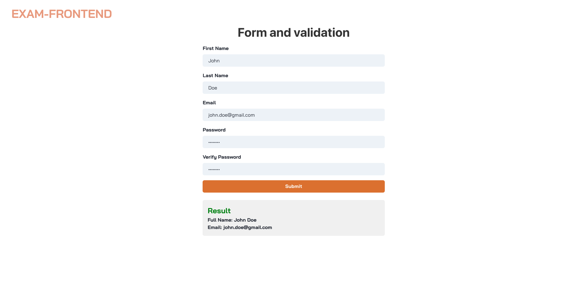

# Frontend
- สามารถใช้ Vue, React, Angular, Svelte หรือ Framework ใดๆ ในการสอบก็ได้
- สามารถใช้ CSS Framework หรือจะ custom CSS เองก็ได้
- `(Optional)` สามารถใช้งาน Library ที่เกี่ยวของกับ WebGL ได้ เช่น Three.js, D3, babylon.js หรือ Library ใดๆ ก็ได้ในการ render model

## Requirement

สร้าง Landing Page ขึ้นมา โดยมี Section ทั้งหมด 2 Section ดังนี้
1. Hero Section
2. Form and validation Section
- ** หมายเหตุ  ข้อ 1-2 ไม่จำเป็นต้องทำเหมือนกับข้อสอบ เป็นเพียงแค่แนวทางในการวาง layout เท่านั้น ```สามารถออกแบบใหม่ได้ทั้งหมด```
 
## 1. Hero Section
- ### สร้าง Hero Section โดยใช้ model iPhone จาก `model.zip` แล้วทำการ animation model ตามตัวอย่าง video ด้านล่าง

  ### **หากไม่สามารถ render model ตามตัวอย่างได้ สามารถออกแบบ section นี้เองได้
  ### ***หากสามารถ render model ได้แล้วออกแบบ animation model ใหม่ให้ดูดีกว่าตัวอย่างได้จะ`พิจารณาเป็นพิเศษ`

## 2. Form and validation Section
- ### สร้าง form สำหรับกรอกข้อมูล ดังตัวอย่าง
  
- ### validate inputs ข้อมูลแต่ละชนิดให้ถูกต้อง หากไม่ถูกต้องให้แจ้งเตือน
  
- ### เมื่อ validate form ผ่านให้แสดงผลลัพท์ดังตัวอย่างด้านล่าง
  
## Deployment
- หากทำบททดสอบเสร็จแล้วให้เอาขึ้นไปยัง Github ของตัวเอง ตั้ง Repository เป็น Public ด้วย
- ตอบกลับอีเมลโดยแนบ Git Repository กลับมายังอีเมล <xxx@gmail.com>
- Deploy application ขึ้นไปยัง Hosting ใดก็ได้ แนะนำผู้ให้บริการตามด้านล่าง
  - Github Page
  - Firebase Hosting
  - Vercel
  - Netlify
  - Heroku

## Problem
หากมีปัญหาหรือข้อสงสัยให้ติดต่อกลับโดยด่วน ผ่านช่องทางดังต่อไปนี้
- <xxx@gmail.com>